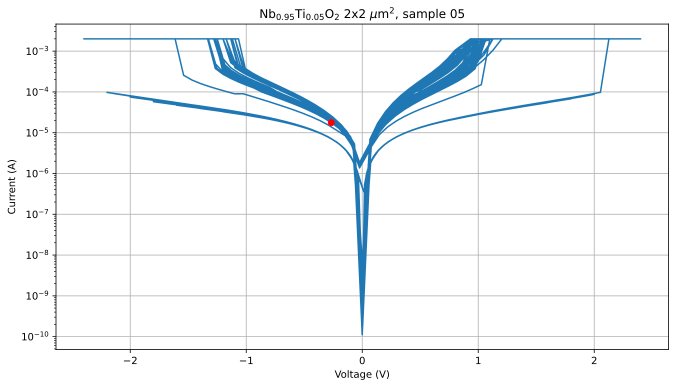

# NbO2 - Summer Research
<a name="readme-top"></a>


<!-- PROJECT SHIELDS -->
<!--
*** I'm using markdown "reference style" links for readability.
*** Reference links are enclosed in brackets [ ] instead of parentheses ( ).
*** See the bottom of this document for the declaration of the reference variables
*** for contributors-url, forks-url, etc. This is an optional, concise syntax you may use.
*** https://www.markdownguide.org/basic-syntax/#reference-style-links
-->


<!-- PROJECT LOGO -->
<br />
<div align="center">
  <a href="https://github.com/othneildrew/Best-README-Template">
    
  </a>

  <h3 align="center">NbO2 Research</h3>

  <p align="center">
    This code is used to analyze IV curves for Prof. Matt Sullivan's research
    <br />
  </p>
</div>


<!-- TABLE OF CONTENTS -->
<details>
  <summary>Table of Contents</summary>
  <ol>
    <li>
      <a href="#what-is-IV-curve">What is an IV Curve?</a>
    </li>
    <li>
      <a href="#getting-started">Raw data</a>
      <ul>
        <li><a href="#prerequisites">asdf</a></li>
        <li><a href="#installation">asdf</a></li>
      </ul>
    </li>
    <li><a href="#roadmap">Creating an IV Curve</a></li>
    <li><a href="#contributing">Filtering Data</a></li>
    <li><a href="#license">Filtered IV Curve</a></li>
    <li><a href="#contact">Finding Threshold and Hold Voltages</a></li>
    <li><a href="#acknowledgments">Acknowledgments</a></li>
  </ol>
</details>


<!-- ABOUT THE PROJECT -->
## What is an IV Curve?

[![Product Name Screen Shot][product-screenshot]]

An IV curve is a graph showing the relationship between the current and voltage flowing through a device. The y-axis is on a logrithmic scale. 

In this code, I used Python to create these graphs and find theshold and hold voltages for each device. 


<!-- Here's why:
* Your time should be focused on creating something amazing. A project that solves a problem and helps others
* You shouldn't be doing the same tasks over and over like creating a README from scratch
* You should implement DRY principles to the rest of your life :smile: -->


<!-- Use the `BLANK_README.md` to get started. -->

<p align="right">(<a href="#readme-top">back to top</a>)</p>


## Raw data

Data is recorded into a txt file in 3 columns. The columns are time, current and voltage in that order. First, we need to access the files. For this, I used the pandas library. 

I'll walk you though reading the raw data from one file: 

```python
    # this is where all data files are  
    basePath = r'C:\Users\Ted Mburu\NbO2'
    # this is the name of the desired file
    # format: IVNb (0.95)Ti (0.05)O_2 (24)Sample Number (05162022)Date (05)Device Number
    fileName = r'IVNb0p95Ti0p05O2_24-05162022-05.txt'

    # finds a substring of text inside a larger string of text inbetween certain substrings
    def find_between( s, first, last ):
        try:
            start = s.index( first ) + len( first )
            end = s.index( last, start )
            return s[start:end]
        except ValueError:
            return ""

    # gather information from the filename

    # the % of Nb
    NbPercentage = str(int(find_between(fileName, "IVNb", "Ti").split('p')[1]) / 100)
    # the % of Ti
    TiPercentage = str(int(find_between(fileName, "Ti", "O2").split('p')[1]) / 100)
    # sample number
    sampleNumber = find_between(fileName, "-", ".txt").split('-')[1]

    # combines the basepath adn filename to navigate to the specific file you're opening
    filePath = ''
    if (NbPercentage  == "0.95"):
        filePath = basePath + r'\Doping05\ '.rstrip() + fileName
    elif (NbPercentage  == "0.90"):
        filePath = basePath + r'\Doping10\ '.rstrip() + fileName
    else: 
        filePath = basePath + r'\Doping0\ '.rstrip() + fileName

    # reads the contents of the file    
    df5 = pd.read_csv(filePath, names=['Time (s)','Current (A)','Voltage (V)'],sep='\t',skiprows=1)
    data=df5.values
    df5.head()

    # store the t, I, and V values in their own respective lists
    t= data[:,0]
    I= data[:,1]
    V= data[:,2]

```


<p align="right">(<a href="#readme-top">back to top</a>)</p>

## Creating an IV Curve

Now the data in that one file is stored in the t, I and V variables. Now we can graph it using matplotlib. 

```python
plt.rcParams['figure.figsize'] = (11,6)
plt.figure(0)
plt.grid()

# graphs data as continuous function on a log scale on the y axis
plt.semilogy(V,I)

plt.xlabel('Voltage (V)');
plt.ylabel('Current (A)');

# creates a title for the graph about the data its showing
nb = 'Nb' if NbPercentage == "1.0" else r'Nb$_{'+ NbPercentage +'}$'
ti = '' if TiPercentage == "0.0" else r'Ti$_{'+ TiPercentage +'}$'
sample = ' sample ' + sampleNumber
title = nb + ti + r'O$_2$ 2x2 $\mu$m$^2$,' + sample
plt.title(title);
```
Result: 



<!-- * [![Next][Next.js]][Next-url]
* [![React][React.js]][React-url]
* [![Vue][Vue.js]][Vue-url]
* [![Angular][Angular.io]][Angular-url]
* [![Svelte][Svelte.dev]][Svelte-url]
* [![Laravel][Laravel.com]][Laravel-url]
* [![Bootstrap][Bootstrap.com]][Bootstrap-url]
* [![JQuery][JQuery.com]][JQuery-url] -->

<p align="right">(<a href="#readme-top">back to top</a>)</p>


## Filtering Data
The data on the graph above is everything that is in the txt file. There is a lot of work that goes into filtering out the "bad" data before we can analyze the graph. 

### Burn Through 
When the data starts being recorded, the device hasn't "burned though" the threshhold to start taking data we want to analyze. On the left side of the graph, you can see as the voltage oscilates through around -2 to 2 Volts, some of the current doesn't reach the max value. We need to get rid of that data. 

To do this, we will find the index of the first value that is close to the max value in the current list (variable I) and remove all the data before that index in the time, current and voltage lists. 

```python
# find the largest current value in the data
largestCurrent = np.amax(I)
# We are looking for the first time the current gets close to that value
maxCurrentThreshhold = largestCurrent * 0.99;
indexOfFirstLargeCurrent = np.argmax(I > maxCurrentThreshhold)

# this is the index of the first data point after "buring though"
index = np.size(I) - indexOfFirstLargeCurrent 

# same data as before but the "bad" data has been removed
plt.rcParams['figure.figsize'] = (11,6)
plt.figure(0)
plt.grid()
plt.semilogy(V,I)
plt.xlabel('Voltage (V)');
plt.ylabel('Current (A)');
```
Result: 


<p align="right">(<a href="#readme-top">back to top</a>)</p>

<!-- GETTING STARTED -->
## Getting Started

This is an example of how you may give instructions on setting up your project locally.
To get a local copy up and running follow these simple example steps.

### Prerequisites

This is an example of how to list things you need to use the software and how to install them.
* npm
  ```sh
  npm install npm@latest -g
  ```

### Installation

_Below is an example of how you can instruct your audience on installing and setting up your app. This template doesn't rely on any external dependencies or services._

1. Get a free API Key at [https://example.com](https://example.com)
2. Clone the repo
   ```sh
   git clone https://github.com/your_username_/Project-Name.git
   ```
3. Install NPM packages
   ```sh
   npm install
   ```
4. Enter your API in `config.js`
   ```js
   const API_KEY = 'ENTER YOUR API';
   ```

<p align="right">(<a href="#readme-top">back to top</a>)</p>


<!-- USAGE EXAMPLES -->
## Usage

Use this space to show useful examples of how a project can be used. Additional screenshots, code examples and demos work well in this space. You may also link to more resources.

_For more examples, please refer to the [Documentation](https://example.com)_

<p align="right">(<a href="#readme-top">back to top</a>)</p>


<!-- ROADMAP -->
## Roadmap

- [x] Add Changelog
- [x] Add back to top links
- [ ] Add Additional Templates w/ Examples
- [ ] Add "components" document to easily copy & paste sections of the readme
- [ ] Multi-language Support
    - [ ] Chinese
    - [ ] Spanish

See the [open issues](https://github.com/othneildrew/Best-README-Template/issues) for a full list of proposed features (and known issues).

<p align="right">(<a href="#readme-top">back to top</a>)</p>


<!-- CONTRIBUTING -->
## Contributing

Contributions are what make the open source community such an amazing place to learn, inspire, and create. Any contributions you make are **greatly appreciated**.

If you have a suggestion that would make this better, please fork the repo and create a pull request. You can also simply open an issue with the tag "enhancement".
Don't forget to give the project a star! Thanks again!

1. Fork the Project
2. Create your Feature Branch (`git checkout -b feature/AmazingFeature`)
3. Commit your Changes (`git commit -m 'Add some AmazingFeature'`)
4. Push to the Branch (`git push origin feature/AmazingFeature`)
5. Open a Pull Request

<p align="right">(<a href="#readme-top">back to top</a>)</p>


<!-- LICENSE -->
## License

Distributed under the MIT License. See `LICENSE.txt` for more information.

<p align="right">(<a href="#readme-top">back to top</a>)</p>


<!-- CONTACT -->
## Contact

Your Name - [@your_twitter](https://twitter.com/your_username) - email@example.com

Project Link: [https://github.com/your_username/repo_name](https://github.com/your_username/repo_name)

<p align="right">(<a href="#readme-top">back to top</a>)</p>


<!-- ACKNOWLEDGMENTS -->
## Acknowledgments

Use this space to list resources you find helpful and would like to give credit to. I've included a few of my favorites to kick things off!

* [Choose an Open Source License](https://choosealicense.com)
* [GitHub Emoji Cheat Sheet](https://www.webpagefx.com/tools/emoji-cheat-sheet)
* [Malven's Flexbox Cheatsheet](https://flexbox.malven.co/)
* [Malven's Grid Cheatsheet](https://grid.malven.co/)
* [Img Shields](https://shields.io)
* [GitHub Pages](https://pages.github.com)
* [Font Awesome](https://fontawesome.com)
* [React Icons](https://react-icons.github.io/react-icons/search)

<p align="right">(<a href="#readme-top">back to top</a>)</p>


<!-- MARKDOWN LINKS & IMAGES -->
<!-- https://www.markdownguide.org/basic-syntax/#reference-style-links -->
[contributors-shield]: https://img.shields.io/github/contributors/othneildrew/Best-README-Template.svg?style=for-the-badge
[contributors-url]: https://github.com/othneildrew/Best-README-Template/graphs/contributors
[forks-shield]: https://img.shields.io/github/forks/othneildrew/Best-README-Template.svg?style=for-the-badge
[forks-url]: https://github.com/othneildrew/Best-README-Template/network/members
[stars-shield]: https://img.shields.io/github/stars/othneildrew/Best-README-Template.svg?style=for-the-badge
[stars-url]: https://github.com/othneildrew/Best-README-Template/stargazers
[issues-shield]: https://img.shields.io/github/issues/othneildrew/Best-README-Template.svg?style=for-the-badge
[issues-url]: https://github.com/othneildrew/Best-README-Template/issues
[license-shield]: https://img.shields.io/github/license/othneildrew/Best-README-Template.svg?style=for-the-badge
[license-url]: https://github.com/othneildrew/Best-README-Template/blob/master/LICENSE.txt
[linkedin-shield]: https://img.shields.io/badge/-LinkedIn-black.svg?style=for-the-badge&logo=linkedin&colorB=555
[linkedin-url]: https://linkedin.com/in/othneildrew
<!-- [product-screenshot]: images/screenshot.png -->
[product-screenshot]: screenshot.pdf
[Next.js]: https://img.shields.io/badge/next.js-000000?style=for-the-badge&logo=nextdotjs&logoColor=white
[Next-url]: https://nextjs.org/
[React.js]: https://img.shields.io/badge/React-20232A?style=for-the-badge&logo=react&logoColor=61DAFB
[React-url]: https://reactjs.org/
[Vue.js]: https://img.shields.io/badge/Vue.js-35495E?style=for-the-badge&logo=vuedotjs&logoColor=4FC08D
[Vue-url]: https://vuejs.org/
[Angular.io]: https://img.shields.io/badge/Angular-DD0031?style=for-the-badge&logo=angular&logoColor=white
[Angular-url]: https://angular.io/
[Svelte.dev]: https://img.shields.io/badge/Svelte-4A4A55?style=for-the-badge&logo=svelte&logoColor=FF3E00
[Svelte-url]: https://svelte.dev/
[Laravel.com]: https://img.shields.io/badge/Laravel-FF2D20?style=for-the-badge&logo=laravel&logoColor=white
[Laravel-url]: https://laravel.com
[Bootstrap.com]: https://img.shields.io/badge/Bootstrap-563D7C?style=for-the-badge&logo=bootstrap&logoColor=white
[Bootstrap-url]: https://getbootstrap.com
[JQuery.com]: https://img.shields.io/badge/jQuery-0769AD?style=for-the-badge&logo=jquery&logoColor=white
[JQuery-url]: https://jquery.com 
